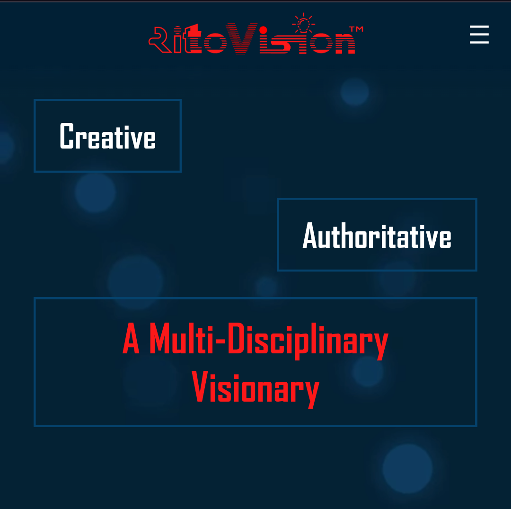
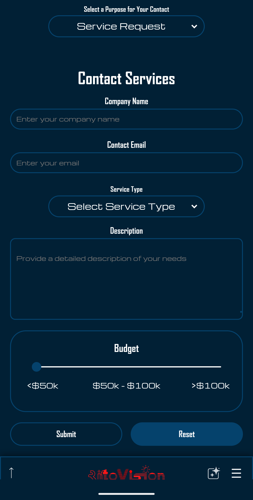
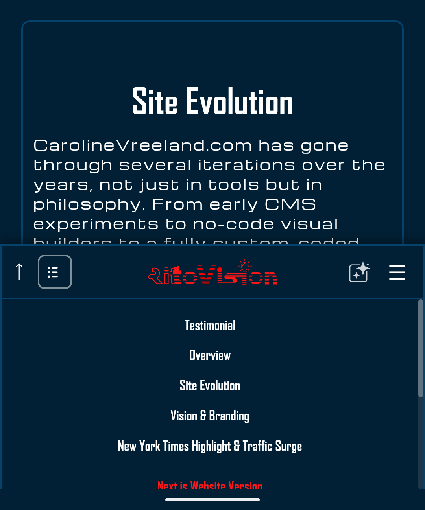
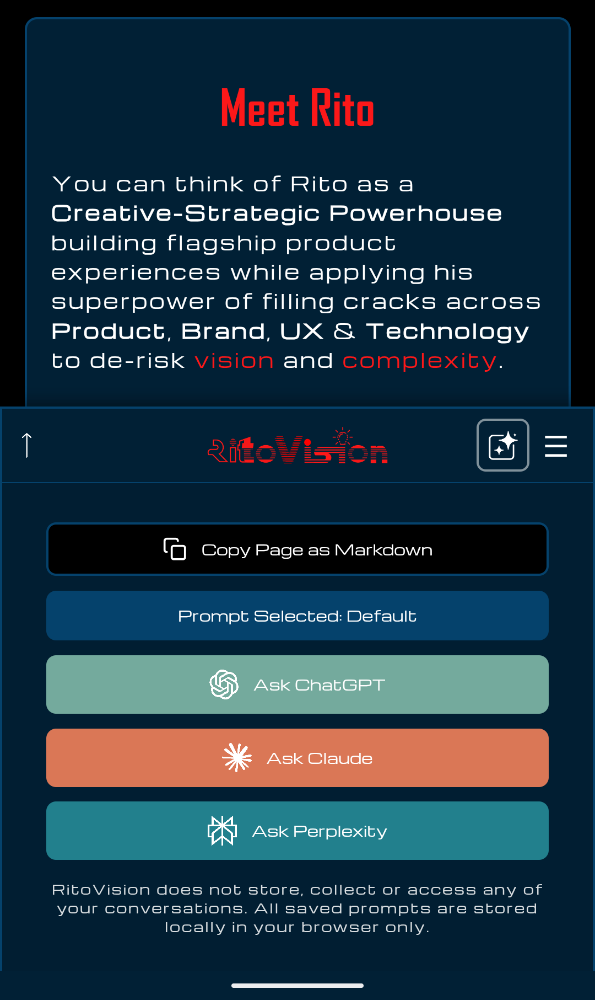
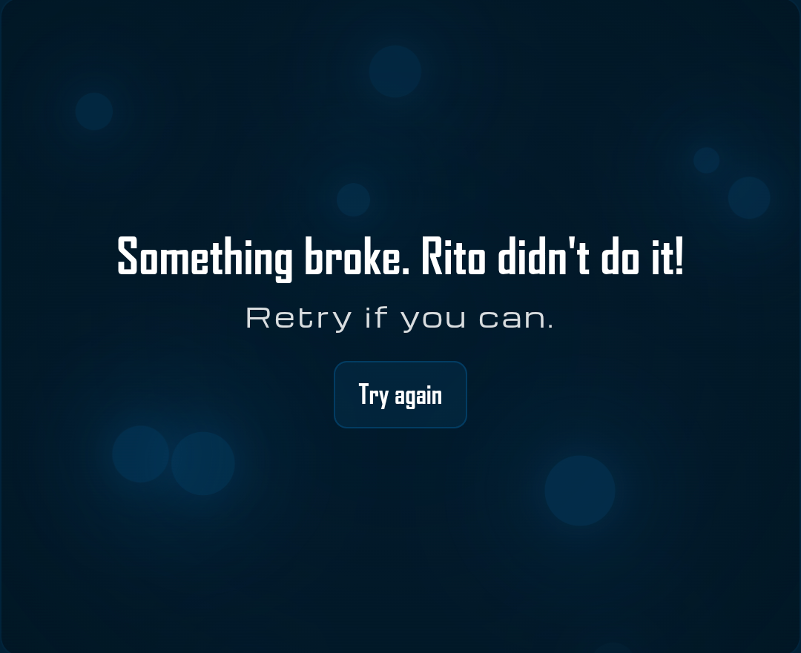

# RitoVision Website

<h1 align="center">
  
</h1>

[](https://ritovision.com)
[](https://ui.ritovision.com)

This is the current flagship website for the [RitoVision](https://ritovision.com) brand. It is content-rich, heavily stylized, built on Next.js App Router 15, and includes an extensive in-app UI library, with components and assets published on a live [Storybook UI](https://ui.ritovision.com) site.

## Table of Contents

* [RitoVision Website](#ritovision-website)

  * [What this repo is](#what-this-repo-is)
  * [Why this website exists](#why-this-website-exists)
  * [License and usage boundaries](#license-and-usage-boundaries)
  * [Brand and design philosophy](#brand-and-design-philosophy)
  * [Identity as an outcome](#identity-as-an-outcome)
  * [Media is part of the brand identity](#media-is-part-of-the-brand-identity)

    * [Hero particles (Pixi + video fallback)](#hero-particles-pixi--video-fallback)
  * [Forms and inputs](#forms-and-inputs)
  * [Bottom bar navigation](#bottom-bar-navigation)
  * [State management (Redux Toolkit)](#state-management-redux-toolkit)
  * [Observability & monitoring](#observability--monitoring)

    * [Runtime error handling (Sentry)](#runtime-error-handling-sentry)
  * [Local development](#local-development)

    * [Manual local navigation](#manual-local-navigation)

      * [Local environment variables](#local-environment-variables)
  * [Testing](#testing)

    * [Vitest (unit and integration)](#vitest-unit-and-integration)
    * [Playwright end-to-end (sitemap smoke + JSON-LD checks)](#playwright-end-to-end-sitemap-smoke--json-ld-checks)
    * [Playwright component tests (Storybook-driven)](#playwright-component-tests-storybook-driven)
    * [Storybook (component workbench)](#storybook-component-workbench)
  * [Structured data (JSON-LD)](#structured-data-json-ld)
  * [Snapshot mirror repo (and why full commit history isn’t included)](#snapshot-mirror-repo-and-why-full-commit-history-isnt-included)
  * [Credits](#credits)

## What this repo is

This repository contains the source for the **RitoVision** website.

Version 2.1 is **solo-built and designed end-to-end by Rito**, intended to demonstrate integration across **product strategy, brand, UX, and engineering** as one cohesive system.

This is not a theme flip or a “personal site template.” It’s a flagship artifact: an intentionally crafted digital identity built to the standard of what a small team of specialists could ship, created with solo ownership and AI-native workflows.

---

## Why this website exists

If I claim to be a multi-disciplinary builder who can ship at a high level across product, brand, UX, and technology, then the most honest way to communicate that I am who I say I am is not through adjectives, but through outcomes.

Plenty of people can rely on a minimalist site and a short bio because their reputation already carries the weight. I could probably do that too.

But that wouldn’t reflect who I am or how I work.

This website exists as **proof by construction**: a visible, interactive, verifiable demonstration of craft. It’s both narrative and evidence. It’s “show, don’t tell,” even when the copy is inevitably verbose, because the larger point is the work itself:

* the interaction design
* the brand system
* the information architecture
* the engineering decisions
* the details that make it feel cohesive

Don’t take my word for it. Look at what I built.

---

## License and usage boundaries

The **source code** in this repository is open source under the **Apache License 2.0**.

However, the **RitoVision brand** is not.

Branding, written content, media assets, and trademark-identifying materials are protected works. You are free to learn from and reuse the code, but if you reuse it, you must **change it sufficiently to clearly distinguish it from the RitoVision identity**.

Using the branding or presentation verbatim would create confusion and could constitute impersonation. Please don’t do that.

---

## Brand and design philosophy

<div align="center">
  
</div>

RitoVision is designed as a balancing act, a tension of opposites that is intentional:

* **Futuristic and slightly cinematic**, with a dark-mode-first mood and Blade Runner-adjacent influence
* **Loud**, but too smooth to be truly loud
* A kind of **watered-down cyberpunk meets overly edgy professional**
* Fonts that feel like a **spaceship that’s also a nightclub**
* **Egotistical in style, grounded in substance**
* “Show and tell,” but tell with aesthetic discipline
* **Trust but verify**: accuracy matters, and claims should be supported with receipts

If the copy reads unusually specific or intense at times, that’s part of the point. Hybrids who don’t fit standard categories often need to invent clearer vocabulary to describe what they actually do.

---

## Identity as an outcome

This website wasn’t built from a strict template, and it wasn’t built from a complete plan.

It was an exploration where two things were discovered in parallel:

1. **Who am I**, as a builder who doesn’t fit neatly into conventional roles?
2. **How do I express that identity** with the same rigor I’d apply to a product, using design, code, and content strategy as the medium?

Some of the copy might look like marketing language at first glance. In reality, it’s an attempt to create a precise vocabulary for a role that isn’t well-contained by existing labels.

The end goal is authenticity with curation. Realness with intention.

---

## Media is part of the brand identity

<div align="center">
  
</div>

RitoVision is my tech builder flagship, but I am not only a builder. I am also a multidisciplinary artist, and media is a major part of how I express identity and craft.

That matters because my work spans multiple co-brand worlds: **RitoRhymes.com** for music and public persona, and **Ritography.com** for visual work like photography, animation, and modeling. This site needs to acknowledge that reality, but in a way that keeps the co-brands distinct instead of blending everything together.

Music, in particular, is non-negotiable. Rito Rhymes has been the public-facing linchpin in press and performance, so I built a custom RitoVision-styled music player using **Howler.js** and embedded songs across the site as part of the storytelling.

The brand also carries a cinematic tone, so motion and imagery do real work here. Hero intros lean into bold entrances, stylized visuals, and page-level choreography. **Framer Motion** drives much of that, and **PixiJS** powers the floating orb background that has become a signature element across the site.

### Hero particles (Pixi + video fallback)

The hero “orb field” is implemented two ways for performance:

* **Desktop (live WebGL):** `pixi.js` via `app/components/utilities/particles/WhiteOrbs/` (used by `app/components/pages/home/hero/HeroOrbsDesktop.tsx` and other backgrounds).
* **Mobile (recorded loop):** pre-rendered captures served from `public/video/` (for example `public/video/Particle-Effect-blueBG-BlueOrbs1.webm`) and used by `app/components/pages/home/hero/HeroOrbs.tsx`. The breakpoint switch is in `app/components/pages/home/hero/HeroOrbsWrapper.tsx` (`>= 730px` = Pixi).
* **CSP/compat:** Pixi expects the client shim `app/components/utilities/particles/PixiCompatClient.tsx` (mounted in `app/layout.tsx`) which imports `@pixi/unsafe-eval`.
* **Other particles:** `@tsparticles/react` is used for small UI/text effects (see `app/components/pages/home/dynamicText/DynamicTextClient.tsx`).

More detail: `app/components/utilities/particles/README.md`.

And since I am visual by nature, images show up as narrative, not decoration. You will even see that in small interactions like the footer and the main menu modal, where images randomize each time you open them, keeping the experience fresh while staying within a finite set of pages.

---

## Forms and inputs

With a background in UX, interactions are always top of mind for me when building digital products. One priority for RitoVision was creating a custom, branded library of input components for every common pattern: dropdowns, form fields, text areas, sliders, radios, checkmarks, and of course buttons.

<div align="center">
  
</div>

The goal is that every interaction leaves a small impression that you are using RitoVision. That means designing each component to feel intentional across every state and variation: default, hover, focus, active, disabled, error, success, loading, and edge cases that only show up in real form flows.

On the implementation side, form behavior is wired end-to-end for reliability. Submissions route to my Cloudflare Worker, and the UI is backed by Formik for form state and submission handling, with Yup providing schema-based validation so error states are predictable and consistent.

All of these components are also wired into Storybook so they can be reviewed and tested in isolation instead of only being evaluated inside full pages.

---

## Bottom bar navigation

Navigation is fundamental to any website experience, and one of my favorite parts of RitoVision was designing and implementing a bottom bar to make the experience feel closer to a native app. It was one of the first complete features I envisioned for the site, and it has evolved into something genuinely useful.

The bar is fixed to the bottom of the screen on both desktop and mobile, but it is designed to stay out of the way when it is not needed. On initial page load it stays hidden since the header already provides branding and main menu access. As you scroll down it appears. When you enter the footer it disappears, and it only returns when you scroll up outside of the footer.

It includes quick access to the main menu (the same one available in the header), a scroll-to-top arrow that disappears when at the top, and it is context sensitive to the page you are on. On pages that have a dedicated table of contents, like long case studies (for example `/projects/jumptag`), an additional icon appears. Pressing it opens a drawer that dynamically loads that page's table of contents into the bottom bar experience. If a page has no table of contents, the icon is simply not there. This keeps navigation seamless on long-form pages, especially on mobile. If you are verbose, you need tools like this.

<div align="center">
  
</div>

The bar also includes an AI drawer, but intentionally not as a token-burning embedded chatbot for strangers. Instead, it supports deep links to external AI providers (ChatGPT, Claude, and Perplexity) so visitors can bring their own tokens and ask questions about the current page by URL. The added twist is prompt control: you can customize and save prompts so the deep link is not just a generic "summarize this URL," but a repeatable question tailored to what you actually want to ask. I use this more heavily on documentation sites (and it appears in `docs.ritoswap.com`), but I wanted to showcase the pattern here too because more sites should adopt it.

<div align="center">
  
</div>

---

## State management (Redux Toolkit)

Global state in this codebase is managed with **Redux Toolkit** (`@reduxjs/toolkit` + `react-redux`). Redux is used primarily for **cross-cutting UI/navigation state** that multiple components and routes need to coordinate (menus, transitions, bottom drawer state, dynamic table-of-contents, AI prompt selection), plus a small amount of “remembered UX” via persistence.

Where it lives:

* **Store:** `store/store.ts` (RTK `configureStore`, preloaded state)
* **Reducers / slices:** `store/rootReducer.ts` + `store/slices/**`
* **Provider:** `providers/ReduxProvider.tsx`, mounted at the app root in `app/layout.tsx`

Persistence model:

* A custom middleware in `store/localStorage.ts` writes selected state to `localStorage` under `reduxState`.
* Transient UI state (menus, ToC, transitions, etc.) is excluded so fresh sessions and route changes don’t inherit stale UI.

Common patterns:

* **Selector reads:** `useSelector((state: RootState) => ...)` (example: `app/hooks/useDeferredActivation.ts`)
* **Dispatch writes:** `useDispatch()` + `dispatch(actionCreator(...))` (example: `app/hooks/navigation/toc/useRegisterToc.ts`)

---

## Observability & monitoring

### Runtime error handling (Sentry)

This repo includes **Sentry** (`@sentry/nextjs` v10) wiring intended to capture unexpected **client-side runtime errors**, while rendering branded fallback UI instead of a generic crash.

<div align="center">
  
</div>

Where Sentry is initialized:

* Client-side Sentry initialization is defined in `instrumentation-client.ts` via `Sentry.init(...)` (sampling, `sendDefaultPii: false`, and a `beforeSend` filter for noisy events).

How errors render + get logged:

* Route/segment error boundary: `app/error.tsx` re-exports `app/components/errors/PageError.tsx`, which logs via `Sentry.captureException(error)` and renders `app/components/errors/ErrorShellInline.tsx` with a retry wired to Next’s `reset()`.
* Global fallback: `app/global-error.tsx` logs via `Sentry.captureException(error)` and renders `app/components/errors/ErrorShellFullPage.tsx`.

Quick manual check:

* `app/test-errors/page.tsx` intentionally throws an error to exercise the inline error shell (the route redirects away in production).

Ad hoc logging:

* Client components can call `Sentry.captureException(err)` (or `Sentry.captureMessage(...)`) close to the source so events include actionable context.

Note on auth/source maps:

* `.env.sentry-build-plugin` is intentionally ignored by git; `SENTRY_AUTH_TOKEN` should be provided via local env/CI and not committed.

---

## Local development

### Manual local navigation

Install deps:

```bash
pnpm install
```

Run the site locally for manual navigation:

```bash
pnpm dev
```

For an e2e-realistic run (and to generate the sitemap that Playwright smoke tests use), run a production build and serve it:

```bash
pnpm build
pnpm start -p 3000
```

This project is set up to be reachable on your local network, so you can open it on a mobile device on the same Wi-Fi (helpful for checking responsive behavior and touch interactions).

#### Local environment variables

Copy `.env.example` to `.env` and set the following:

```bash
NEXT_PUBLIC_ENABLE_FORM_MOCKING=true
LOCAL_IP_ADDRESS=
NEXT_PUBLIC_FORMS_API_URL=
```

What they do:

* `NEXT_PUBLIC_ENABLE_FORM_MOCKING=true`
  Enables local form submission mocking so the contact forms work without calling external services.

* `LOCAL_IP_ADDRESS=`
  Set this to your machine’s LAN IP if you want QR codes, deep links, or local network access patterns to resolve cleanly (Next can be picky about what it considers a valid local origin).

* `NEXT_PUBLIC_FORMS_API_URL=`
  Optional. Set this if you want form submissions to hit a real endpoint instead of mocks.

---

## Testing

### Vitest (unit and integration)

Run the test suite:

```bash
pnpm test
```

Coverage:

```bash
pnpm test:coverage
```

Coverage note: this repo is large and intentionally not “100 percent everything.” The testing approach prioritizes critical and reusable logic (utilities, form validation, adapters, components with complex states) to reduce regression risk without turning the test suite into a second full-time project. There are 90+ test files today, with the focus on maintainability and high leverage coverage rather than blanket percentage chasing.

If you want a more meaningful signal than overall coverage, run coverage on a specific area or file:

```bash
pnpm vitest run test/lib/forms/validation/__tests__/contact.test.ts --coverage
```

Testing stack highlights:

* Vitest + Vite tooling
* Testing Library (React, user-event, jest-dom)
* happy-dom for DOM-like test runtime
* fakerjs for realistic test data generation

---

### Playwright end-to-end (sitemap smoke + JSON-LD checks)

Run the full e2e suite:

```bash
pnpm e2e
```

Helpful modes:

```bash
pnpm e2e:ui
pnpm e2e:debug
pnpm e2e:stable
pnpm e2e:strict
pnpm e2e:jsonld
```

How the sitemap smoke tests work:

* Playwright boots the built Next.js app (build + start on port 3000).
* It loads `/sitemap.xml` (configurable via `SITEMAP_PATH`) and visits each route.
* It verifies routes render successfully, with optional console policies.

How the JSON-LD test works:

* It runs the same sitemap-driven crawl.
* On each route it extracts JSON-LD scripts and attaches them to the Playwright report for inspection.
* You can turn on stricter requirements via environment flags:

  * `JSONLD_REQUIRE_BREADCRUMB=1`
  * `JSONLD_REQUIRE_SITE_NAV=1`

Filtering and strictness are environment-driven (include/exclude patterns, console policies, screenshot toggles), so you can keep the default run lightweight and dial it up when you are hardening releases.

---

### Playwright component tests (Storybook-driven)

Component tests run against isolated UI inside Storybook (port 6006), including form behavior and Formik adapter flows.

Run component tests:

```bash
pnpm component
```

Helpful modes:

```bash
pnpm component:ui
pnpm component:debug
```

These tests load stories directly through Storybook’s `iframe.html` view, then interact with the component like a user would. This is especially useful for validating input states, validation messaging, and submit/reset flows without needing to navigate full pages.

---

### Storybook (component workbench)

Storybook is heavily themed to match the RitoVision UI system and documents the in-app component library. A live build is published at `ui.ritovision.com`.

Run Storybook locally:

```bash
pnpm sb
```

Build Storybook:

```bash
pnpm build-sb
```

Serve the static Storybook build:

```bash
pnpm serve-sb
```

---

## Structured data (JSON-LD)

This site uses structured data (JSON-LD) to improve clarity for search engines and to reinforce an evidence-based approach to representation.

---

## Snapshot mirror repo (and why full commit history isn’t included)

This is published as a **snapshot mirror repo**.

In many open source projects, especially community-governed tools, libraries, or systems that handle sensitive information, full transparency including detailed commit history can be important for trust, governance, and provenance.

This project is different.

While the code is open source, the website is **not intended to be a widely distributed foundation for others to build upon**, and it does **not** manage sensitive user data in a way that demands a public audit trail of every step taken during creation.

More personally, my creative process is not a spectator sport.

I don’t prefer building under the assumption that every intermediate step will be examined. You don’t expect an artist to publish the full history of every brushstroke. Sometimes creators do share process for posterity, but it isn’t the default, and it isn’t required for the work to stand on its own.

I also take commit quality seriously when it matters, for example public open source contributions and collaborative codebases. Curating a clean, narrative commit history to my standards takes significant bandwidth. For a large, exploratory creative build like this, I’d rather share the **result** clearly than perform a version-control autobiography I can’t curate properly right now.

---

## Credits

While the website is built end to end by Rito, it stands on the shoulders of open source tooling and the communities that make modern web development possible.

If you’re exploring this repo to learn from it, welcome. If you’re exploring it to clone an identity, don’t. Make it yours.
